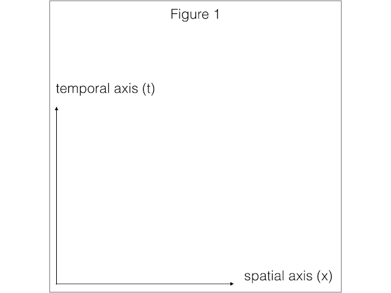
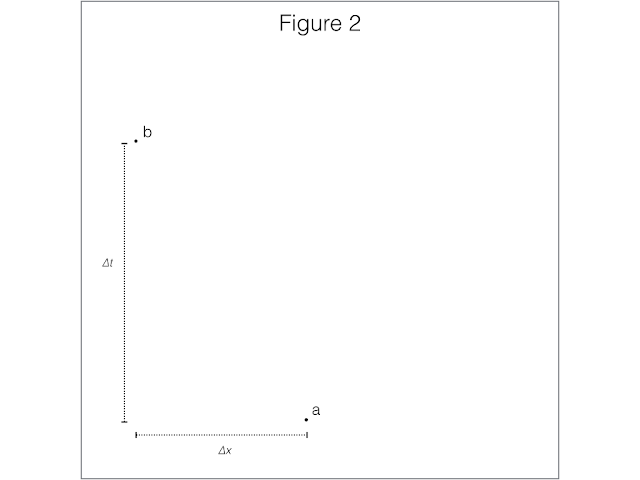
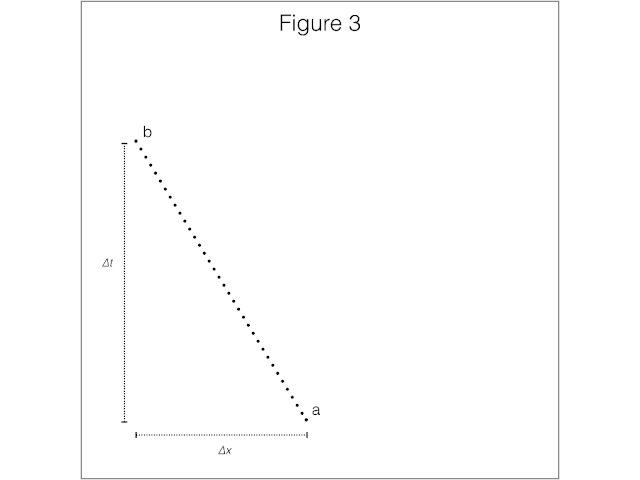
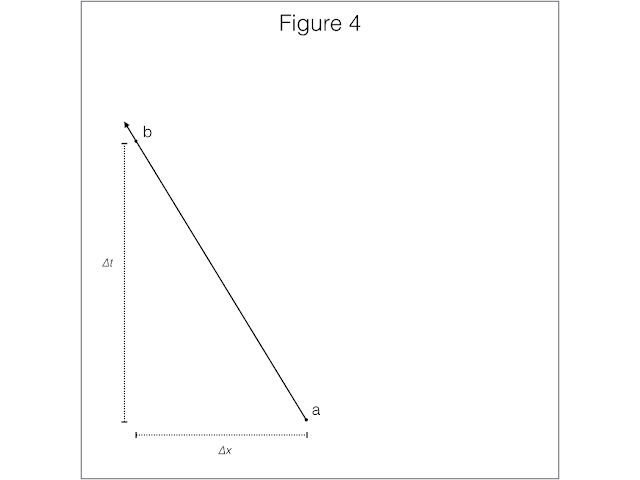

(For the first part in this series, you can go here)

World-lines and Space-times
In the previous post we claimed that the basic ('primitive') elements of our theory (SR) are events. Events are 'happenings', like the bang from a firecracker---things that occur at a particular place in both space and time. In this post we'll look at how to represent events graphically, so that we can use our geometric intuition to think about the relations between them (which, remember, is what SR is all about).

Recall that we spoke of events as having spatial and temporal coordinates. A meeting might be at 3rd and Pine (your x and y coordinates), on the fourth floor (your z coordinate), at 4pm (your t coordinate). How would we represent this graphically? We can represent three spatial coordinates with a 3D model (perhaps a scale model of downtown), but how would we add in the fourth? Not without difficulty! We could, instead, decide to 'suppress' one of the spatial dimensions (maybe the z axis) and represent the movement of time in this dimension. To make things maximally simple, for our discussion we are going to suppress two of the spatial dimensions, so that we're left with exactly one spatial dimension (as a convention we'll choose the x axis), and one temporal dimension (which we'll place on the vertical axis).

So, our representation of space-time will look like figure 1. The area inside the box will be our representation, and I've drawn in the axes for time and space. I'll leave these out in the future, but don't forget they're there.

Now, given this space-time, we can mark an event by a point. Two events will have a spatial and temporal distance between them, which we can call the change in x and the change in t (abbreviated ∆x and ∆t), see figure 2.

What are these points? Remember, they are not persistent objects, but events: ephemeral 'happenings'. What about persistent objects? The way we'll think of them are as series of events linked together. Suppose we had a sequence of events, all lined up, between events a and b, like in figure 3.

If these events became spaced so close together so that at any spatial coordinate there was an event at the appropriate temporal coordinate (and vice-versa), then we could safely say that these events represented an object (like a baseball, or perhaps a person). In figure 4 we represent an object moving (in both time and space!).

In fact, not only does this line represent an object moving, it can tell us a lot about that motion. Suppose that ∆x = 2 meters, and ∆t = 4 seconds. The velocity of an object is just its change in position divided by the change in time, and so we can calculate the velocity for this object: ∆x/∆t = 0.5 m/s! In general, the slope of any straight line in our representation will encode the velocity of the object represented by that line. (And, by extension, the tangent to any curve will encode the instantaneous velocity of the object. Pop quiz: if a straight line represents an object with a constant velocity, what does a curved line represent?)

The simplest case to consider is an object represented by a straight vertical line. Take me for example. Sitting here, slumped in my chair, you can think of me as a continuous series of events. But as I write this, I'm not moving in space—I'm just here, sedentary, not doing anything. Time keeps ticking by, so for each event-part of me, it has a different temporal coordinate. Take any two different events consisting of me sitting here and measure the ∆x and ∆t. Whatever the change in time, the change in position is zero, and so 0/∆t = 0 m/s.

The other limit case would be a horizontal line. What does this represent? We'll talk about the answer in the next post.

That's all for now! Again, to recap, we represent events in space-time as points in our coordinate system. Continuous series of events represent an object (I'm just a series of 'me'-'happenings'!). Finally, the slope of that series of events represents the velocity of the object traveling through space.

We now have our complete representation. Next time we'll look at different physical interpretations in this model, comparing two non-relativistic theories: aristotelian and galilean space-times.